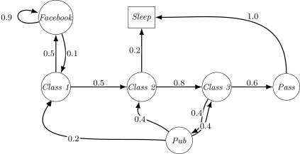
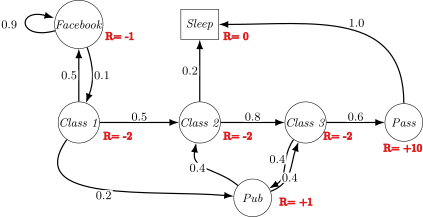
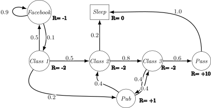

#+Title: Markov Decision Processes
#+Author: James Brusey
#+Date: 
#+Email: james.brusey@coventry.ac.uk
#+Options: toc:nil num:nil timestamp:nil tex:mathjax
#+REVEAL_WIDTH: 1200
#+REVEAL_HEIGHT: 800
#+REVEAL_MARGIN: 0.1
#+REVEAL_MIN_SCALE: 0.1
#+REVEAL_MAX_SCALE: 2.5
#+REVEAL_TRANS: slide
#+REVEAL_SLIDE_NUMBER: t
#+REVEAL_THEME: serif
#+REVEAL_HEAD_PREAMBLE: <meta name="description" content="J Brusey - ">
#+REVEAL_MATHJAX_URL: https://cdn.jsdelivr.net/npm/mathjax@3/es5/tex-chtml-full.js
#+REVEAL_EXTRA_CSS: custom.css
#+REVEAL_HLEVEL: 1

* Overview
 1. Markov Processes
 2. Markov Reward Processes
 3. Markov Decision Processes
 4. Extensions to MDPs

* Markov Processes
** Introduction to MDPs

- Markov decision processes formally describe an environment for
  reinforcement learning
- Where the environment is fully observable
- i.e., the current state completely characterises the process
- Almost all RL problems can be formalised as MDPs, e.g.,
     - Optimal control primarily deals with continuous MDPs
     - Partially observable problems can be converted into MDPs
     - Bandits are MDPs with one state

** Markov Property

"The future is independent of the past given the present"

#+begin_definition
A state is Markov if and only if
$$
\mathbb{P}[S_{t+1} \mid S_t] = \mathbb{P} [S_{t+1} \mid S_1, \ldots, S_t]
$$
#+end_definition

- The state captures all relevant information from the history

- Once the state is known, the history may be thrown away

- i.e., The state is a sufficient statistic of the future

** State Transition Matrix

- For a Markov state and successor state, the state transition
  probability is defined by
  $$
  \mathcal{P}_{ss^{\prime}}=\mathbb{P}[S_{t+1}=s^{\prime}|S_{t}=s]
  $$

- State transition matrix defines transition probabilities from all
  states to all successor states
  $$
  \mathcal{P}=\begin{bmatrix}\mathcal{P}_{11}&...&\mathcal{P}_{1n}\\ \vdots&&&\\ \mathcal{P}_{n1}&...&\mathcal{P}_{nn}\end{bmatrix}
  $$
  where each row of the matrix sums to 1

** Markov Process

- A Markov process is a memoryless random process, i.e. a sequence of
  random states with the Markov property
  
#+begin_definition
A Markov Process (or Markov Chain) is a tuple $\langle \mathcal{S}, \mathcal{P}\rangle$ 
- $\mathcal{S}$ is a (finite) set of states
- $\mathcal{P}$ is a state transition probability matrix, $\mathcal{P}_{ss^{\prime}}=\mathbb{P}[S_{t+1}=s^{\prime}|S_{t}=s]$
#+end_definition

** Example: Student Markov Chain
#+attr_html: :height 400px

** Example: Student Markov Chain Episodes
#+REVEAL_HTML: 

#+REVEAL_HTML: 

Sample *episodes* for Student Markov Chain starting from $S_1 = C1$:
$$
S_1, S_2, \ldots, S_T
$$

- C1 C2 C3 Pass Sleep

- C1 FB FB C1 C2 Sleep

- C1 C2 C3 Pub C2 C3 Pass Sleep
- C1 FB FB C1 C2 C3 Pub C1 FB FB FB C1 C2 C3 Pub C2 Sleep
#+REVEAL_HTML: 

** Example: Student Markov Chain Episodes
#+REVEAL_HTML: 

#+REVEAL_HTML: 

$$
\mathcal{P} =   \begin{array}{c@{\;}c}
  & \begin{array}{ccccccc}
     C1 & C2 & C3 & \textit{Pass} & \textit{Pub} & \textit{FB} & \textit{Sleep}
    \end{array} \\[0.3em]  \begin{array}{c}
     C1 \\ C2 \\ C3 \\ \textit{Pass} \\ \textit{Pub} \\ \textit{FB} \\ \textit{Sleep}
  \end{array} & \left(   \begin{array}{ccccccc}
  & 0.5 & & & & 0.5 & \\
  & & 0.8 & & & & 0.2 \\
  & & & 0.6 & 0.4 & & \\
  & & & & & & 1.0 \\
  0.2 & 0.4 & 0.4 \\
  0.1 & & & & & 0.9 & \\
  & & & & & & 1.0 
  \end{array}  \right)
\end{array}
$$

#+REVEAL_HTML: 

* Markov Reward Processes

** Markov Reward Processes
- A Markov reward process is a Markov chain with values
#+begin_definition
A Markov Reward Process is a tuple $(S, \mathcal{P}, \mathcal{R}, \gamma)$
- $S$ is a finite set of states

- $\mathcal{P}$ is a state transition probability matrix

- $\mathcal{R}$ is a reward function, $\mathcal{R}_{s}=\mathbb{E}[R_{t+1}|S_{t}=s]$

- $\gamma$ is a discount factor, $\gamma \in [0, 1]$ 
#+end_definition
** Example: Student MRP
#+attr_html: :height 400px

** Return
#+begin_definition
The return $G_t$ is the total discounted reward from time-step $t$
$$
G_t = R_{t+1} + \gamma R_{t+2} + ... = \sum_{k=0}^{\infty} \gamma^k R_{t+k+1}
$$
#+end_definition
- The discount $\gamma \in [0, 1]$ is the present value of future rewards
- This values immediate reward above delayed reward
  - $\gamma$ close to 0 leads to "myopic" evaluation;
  - $\gamma$ close to 1 leads to "far-sighted" evaluation
** Why discount?

- Mathematically convenient to discount rewards

- Avoids infinite returns in cyclic Markov processes

- Uncertainty about the future may not be fully represented

- If the reward is financial, immediate rewards may earn more interest

- Animal/human behaviour shows preference for immediate reward

- It is sometimes possible to use undiscounted processes (i.e., $\gamma=1$) if all
  sequences terminate

** Value Function

The value function gives the long-term value of state $s$
#+begin_definition
The /state value function/ $v(s)$ of an MRP is the expected return starting from state $s$
$$
v(s) = \mathbb{E} [G_t | S_t = s]
$$
#+end_definition

** Example: Student MRP Returns
Sample *returns* for Student MRP:

Starting from $S_1=C1$ with $\gamma=\frac{1}{2}$:
$$
G_1 = R_2 + \gamma R_3 + \cdots + \gamma^{T-2}R_T
$$

- C1 C2 C3 Pass Sleep
  - $G_1 = −2 − \frac{2}{2} - \frac{2}{4} + \frac{10}{8} = -2.25$
- C1 FB FB C1 C2 Sleep
  - $G_1 = −2 − \frac{1}{2} - \frac{1}{4} - \frac{2}{8} - \frac{2}{16}=−3.125$
- C1 C2 C3 Pub C2 C3 Pass Sleep
  - $G_1 = −2 − \frac{2}{2} − \frac{2}{4} + \frac{1}{8} − \frac{2}{16} - \frac{2}{32} + \frac{10}{64} \approx −3.41$

    
** Bellman Equation for MRPs

- The value function can be decomposed into two parts: immediate reward $R_{t+1}$ and discounted value of successor state $\gamma v(S_{t+1})$ 

- $v(s) = \mathbb{E} [R_{t+1} + \gamma v(S_{t+1}) | S_t = s]$

- $v(s) = \mathcal{R}_s + \gamma \sum_{s' \in S} \mathcal{P}_{ss'} v(s')$

** Example: Student MRP Values
#+REVEAL_HTML: 

#+attr_html: :height 410px

#+REVEAL_HTML: 

For $\gamma=1$, solving the Bellman equations gives

\begin{array}{c|rrrrrrr}
s & FB & C1 & C2 & C3 & Pub & Pass & Sleep\\ \hline
v(s) & -22.54 & -12.54 & 1.46 & 4.32 & 0.80 & 10 & 0
\end{array}

For example,
$$v(C1)=-2+0.5v(C2)+0.5v(FB)\approx-12.54.$$
#+REVEAL_HTML: 

** Bellman Equation in Matrix Form
- The Bellman equation can be expressed concisely using matrices: $v = \mathcal{R} + \gamma \mathcal{P} v$

  \begin{equation}  
   \begin{bmatrix} v(1) \\ \vdots \\ v(n) \end{bmatrix} = \begin{bmatrix} \mathcal{R}_1 \\ \vdots \\ \mathcal{R}_n \end{bmatrix} + \gamma \begin{bmatrix} \mathcal{P}_{11} & \dots & \mathcal{P}_{1n} \\ \vdots & \ddots & \vdots \\ \mathcal{P}_{n1} & \dots & \mathcal{P}_{nn} \end{bmatrix} \begin{bmatrix} v(1) \\ \vdots \\ v(n) \end{bmatrix} \end{equation}

 

** Solving the Bellman Equation

- The Bellman equation is a linear equation and can be solved directly:
  \begin{eqnarray}
  v & = & \mathcal{R} + \gamma \mathcal{P} v\\
  (I - \gamma \mathcal{P} ) v & = & \mathcal{R} \\
  v & = & (I - \gamma \mathcal{P})^{-1} \mathcal{R}
  \end{eqnarray}

- Computational complexity is $O(n^3)$  for $n$ states
- Direct solution only possible for small MRPs
- Iterative methods for large MRPs:
    - Dynamic programming
    - Monte-Carlo evaluation
    - Temporal-Difference learning
      
* Markov Decision Processes

- An MDP is a Markov reward process with decisions
#+begin_definition
A Markov Decision Process is a tuple $\langle S, A, \mathcal{P}, \mathcal{R}, \gamma \rangle$
- $S$ is a finite set of states,
- $A$ is a finite set of actions,
- $\mathcal{P}$ is an action-indexed collection of state transition probability matrices,
- $\mathcal{P}_{ss'}^a = \mathbb{P} [S_{t+1} = s' | S_t = s, A_t = a]$
- $\mathcal{R}$ is a reward function, $\mathcal{R}_s^a = \mathbb{E} [R_{t+1} | S_t = s, A_t = a]$
- $\gamma$ is a discount factor $\gamma \in [0, 1]$
#+end_definition

** Policies
#+begin_definition
  A policy $\pi$ is a distribution over actions given states, $\pi(a|s) = \mathbb{P} [A_t = a | S_t = s]$
- A policy fully defines the behaviour of an agent
- Under a stationary Markov policy, $A_t \sim \pi(\cdot|S_t)$
- Given a policy $\pi$, the MDP reduces to a Markov process $\langle S, \mathcal{P}^\pi \rangle$ and a Markov reward process $\langle S, \mathcal{P}^\pi, \mathcal{R}^\pi, \gamma \rangle$
  #+end_definition
Note: we restrict attention to stationary policies
** Value Functions
#+begin_definition
The /state-value function/ $v_\pi(s)$ of an MDP is the expected return starting from state $s$, and then following policy $\pi$
$$v_\pi(s) = \mathbb{E}_\pi [G_t | S_t = s]$$
#+end_definition
#+begin_definition
The /action-value function/ $q_\pi(s, a)$ is the expected return starting from state $s$, taking action $a$, and then following policy $\pi$
$$
q_\pi(s, a) = \mathbb{E}_\pi [G_t | S_t = s, A_t = a]
$$
#+end_definition

** From State Value to Action Value
#+attr_html: :height 240px

Choose an action according to the policy and average its action value:
$$
v_\pi(s)=\sum_{a\in A}\pi(a\mid s)q_\pi(s,a).
$$

** From Action Value to the Next State
#+attr_html: :height 260px

Average over the reward and successor state produced by $(s,a)$:
$$
q_\pi(s,a)=\mathcal{R}_s^a+\gamma\sum_{s'\in S}\mathcal{P}_{ss'}^a v_\pi(s').
$$

** Bellman Expectation Equation
The state-value function can again be decomposed into immediate
reward plus discounted value of successor state,
$$
v_\pi(s) = \mathbb{E}_\pi [R_{t+1} + \gamma v_\pi(S_{t+1}) | S_t = s]
$$
The action value function can similarly be decomposed
$$q_\pi(s, a) = \mathbb{E}_\pi [R_{t+1} + \gamma q_\pi(S_{t+1}, A_{t+1}) | S_t = s, A_t = a]$$

** Full State-value Backup
#+REVEAL_HTML: 

#+attr_html: :height 400px

#+REVEAL_HTML: 

The two one-step backups combine to give
$$
v_\pi(s)=\sum_a\pi(a\mid s)
\left(\mathcal{R}_s^a+\gamma
\sum_{s'}\mathcal{P}_{ss'}^a v_\pi(s')\right).
$$

- Policy $\pi$ weights actions.
- Dynamics $\mathcal{P}$ weights successor states.
- Rewards and successor values are backed up to $s$.
#+REVEAL_HTML: 

** Worked Student-MDP Backup
At $C3$, compare two actions using the Student values above ($\gamma=1$):

$$
\begin{aligned}
q_\pi(C3,\textit{study}) &= -2 + v_\pi(Pass) = -2+10=8,\\
q_\pi(C3,\textit{pub})   &= +1 + v_\pi(Pub) = 1+0.80=1.80.
\end{aligned}
$$

The greedy one-step improvement therefore chooses $\textit{study}$ at $C3$.
This is the practical meaning of backing up successor-state values into an action choice.

** Optimal Value Functions
#+begin_definition
The /optimal state-value function/ $v_*(s)$ is the maximum value function over all policies
$$v_*(s) = \max_\pi v_\pi (s)$$

The /optimal action-value function/ $q_*(s,a)$ is the maximum action-value function over all policies
$$q_*(s,a) = \max_\pi q_\pi(s,a)$$
#+end_definition
- The optimal value function specifies the best possible performance for the MDP
- The MDP is *solved* when we know what the optimal value function is 

** Optimal Policy

Define a partial ordering over policies

$$\pi \geq \pi ' \text{ if } v_\pi (s) \geq v_{\pi'} (s), \forall s$$

#+begin_definition
For any finite discounted ($\gamma < 1$) MDP,
- There exists an optimal policy $\pi_*$ that is better than or equal to all other policies, $\pi_* \geq \pi, \forall \pi$
- All optimal policies achieve the optimal value function, $v_{\pi_*} (s) = v_* (s)$
- All optimal policies achieve the optimal action-value function, $q_{\pi_*} (s, a) = q_* (s, a)$
#+end_definition
** Finding an Optimal Policy
An optimal policy can be found by maximizing over $q_*(s, a)$:
 $$
\pi_*(a|s) = \begin{cases} \frac{1}{m(s)} & \text{if } a \in \text{argmax}_{a' \in A} q_*(s, a') \\ 0 & \text{otherwise} \end{cases}$$

- $m(s)=\left|\arg\max_{a'\in A}q_*(s,a')\right|$  is the number of elements in the argmax
- There is always a deterministic stationary optimal policy for a finite discounted MDP
- If we know $q_*(s, a)$, we immediately have the optimal policy
** Bellman Optimality Equation

- $v_*(s) = \max_a q_*(s, a)$
- $q_*(s, a) = \mathcal{R}_s^a + \gamma \sum_{s' \in S} \mathcal{P}_{ss'}^a v_*(s')$
- $v_*(s) = \max_a \left( \mathcal{R}_s^a + \gamma \sum_{s' \in S} \mathcal{P}_{ss'}^a v_*(s') \right)$

** Solving the Bellman Optimality Equation

- Non-linear equation,

- No general closed-form solution

- Many iterative solution methods:

  - Value Iteration

  - Policy Iteration

  - Q-learning

  - Sarsa

* Extensions to MDPs

- Infinite and continuous MDPs

- Partially observable MDPs (POMDPs)

- Average reward MDPs
