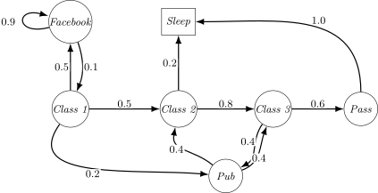
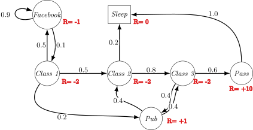

#+Title: Markov Decision Processes
#+Author: James Brusey
#+Date: 
#+Email: james.brusey@coventry.ac.uk
#+Options: toc:nil num:nil timestamp:nil tex:mathjax
#+REVEAL_WIDTH: 1200
#+REVEAL_HEIGHT: 800
#+REVEAL_MARGIN: 0.1
#+REVEAL_MIN_SCALE: 0.1
#+REVEAL_MAX_SCALE: 2.5
#+REVEAL_TRANSITION: slide
#+REVEAL_SLIDE_NUMBER: t
#+REVEAL_THEME: serif
#+REVEAL_HEAD_PREAMBLE: <meta name="description" content="J Brusey - ">
#+REVEAL_MATHJAX_URL: https://cdn.jsdelivr.net/npm/mathjax@3/es5/tex-chtml-full.js
#+REVEAL_EXTRA_CSS: custom.css
#+REVEAL_HLEVEL: 1

* Overview
 1. Markov Processes
 2. Markov Reward Processes
 3. Markov Decision Processes
 4. Extensions to MDPS

* Markov Processes
** Introduction to MDPs

- Markov decision processes formally describe an environment for
  reinforcement learning
- Where the environment is fully observable
- i.e., the current state completely characterises the process
- Almost all RL problems can be formalised as MDPs, e.g.,
     - Optimal control primarily deals with continuous MDPs
     - Partially observable problems can be converted into MDPs
     - Bandits are MDPs with one state

** Markov Property

"The future is independent of the past given the present"

#+begin_definition
A state is Markov if and only if
$$
\mathbb{P}[S_{t+1} \mid S_t] = \mathbb{P} [S_{t+1} \mid S_1, \ldots, S_t]
$$
#+end_definition

- The state captures all relevant information from the history

- Once the state is known, the history may be thrown away

- i.e., The state is a sufficient statistic of the future

** State Transition Matrix

- For a Markov state and successor state , the state transition
  probability is defined by
  $$
  \mathcal{P}_{ss^{\prime}}=\mathbb{P}[S_{t+1}=s^{\prime}|S_{t}=s]
  $$

- State transition matrix defines transition probabilities from all
  states to all successor states
  $$
  \mathcal{P}=\begin{bmatrix}\mathcal{P}_{11}&...&\mathcal{P}_{1n}\\ \vdots&&&\\ \mathcal{P}_{n1}&...&\mathcal{P}_{nn}\end{bmatrix}
  $$
  where each row of the matrix sums to 1

** Markov Process

- A Markov process is a memoryless random process, i.e. a sequence of
  random states with the Markov property
  
#+begin_definition
A Markov Process (or Markov Chain) is a tuple $\langle \mathcal{S}, \mathcal{P}\rangle$ 
- $\mathcal{S}$ is a (finite) set of states
- $\mathcal{P}$ is a state transition probability matrix, $\mathcal{P}_{ss^{\prime}}=\mathbb{P}[S_{t+1}=s^{\prime}|S_{t}=s]$
#+end_definition

** Example: Student Markov Chain
#+attr_html: :height 400px

** Example: Student Markov Chain Episodes
#+REVEAL_HTML: 

#+REVEAL_HTML: 

Sample *episodes* for Student Markov Chain starting from $S_1 = C1$:
$$
S_1, S_2, \ldots, S_T
$$

- C1 C2 C3 Pass Sleep

- C1 FB FB C1 C2 Sleep

- C1 C2 C3 Pub C2 C3 Pass Sleep
- C1 FB FB C1 C2 C3 Pub C1 FB FB FB C1 C2 C3 Pub C2 Sleep
#+REVEAL_HTML: 

** Example: Student Markov Chain Episodes
#+REVEAL_HTML: 

#+REVEAL_HTML: 

$$
\mathcal{P} =   \begin{array}{c@{\;}c}
  & \begin{array}{ccccccc}
     C1 & C2 & C3 & \textit{Pass} & \textit{Pub} & \textit{FB} & \textit{Sleep}
    \end{array} \\[0.3em]  \begin{array}{c}
     C1 \\ C2 \\ C3 \\ \textit{Pass} \\ \textit{Pub} \\ \textit{FB} \\ \textit{Sleep}
  \end{array} & \left(   \begin{array}{ccccccc}
  & 0.5 & & & & 0.5 & \\
  & & 0.8 & & & & 0.2 \\
  & & & 0.6 & 0.4 & & \\
  & & & & & & 1.0 \\
  0.2 & 0.4 & 0.4 \\
  0.1 & & & & & 0.9 & \\
  & & & & & & 1.0 
  \end{array}  \right)
\end{array}
$$

#+REVEAL_HTML: 

* Markov Reward Processes

** Markov Reward Processes
- A Markov reward process is a Markov chain with values
#+begin_definition
A Markov Reward Process is a tuple $(S, \mathcal{P}, \mathcal{R}, \gamma)$
- $S$ is a finite set of states

- $\mathcal{P}$ is a state transition probability matrix

- $\mathcal{R}$ is a reward function, $\mathcal{R}_{s}=\mathbb{E}[R_{t+1}|S_{t}=s]$

- $\gamma$ is a discount factor, $\gamma \in [0, 1]$ 
#+end_definition
** Example: Student MRP
#+attr_html: :height 400px

** Return
#+begin_definition
The return $G_t$ is the total discounted reward from time-step $t$
$$
G_t = R_{t+1} + \gamma R_{t+2} + ... = \sum_{k=0}^{\infty} \gamma^k R_{t+k+1}
$$
#+end_definition
- The discount $\gamma \in [0, 1]$ is the present value of future rewards
- This values immediate reward above delayed reward
  - $\gamma$ close to 0 leads to "myopic" evaluation;
  - $\gamma$ close to 1 leads to "far-sighted" evaluation
** Why discount?

- Mathematically convenient to discount rewards

- Avoids infinite returns in cyclic Markov processes

- Uncertainty about the future may not be fully represented

- If the reward is financial, immediate rewards may earn more interest

- Animal/human behaviour shows preference for immediate reward

- It is sometimes possible to use undiscounted processes (i.e., $\gamma=1$) if all
  sequences terminate

** Value Function

The value function gives the long-term value of state $s$
#+begin_definition
The /state value function/ $v(s)$ of an MRP is the expected return starting from state $s$
$$
v(s) = \mathbb{E} [G_t | S_t = s]
$$
#+end_definition

** Example: Student MRP Returns
Sample *returns* for Student MRP:

Starting from $S_1=C1$ with $\gamma=\frac{1}{2}$:
$$
G_1 = R_2 + \gamma R_3 + \cdots + \gamma^{T-2}R_T
$$

** Bellman Equation for MRPs

- The value function can be decomposed into two parts: immediate reward
  and discounted value of successor state

- 

- 

** Bellman Equation in Matrix Form

- The Bellman equation can be expressed concisely using matrices:

- 

** Solving the Bellman Equation

- The Bellman equation is a linear equation and can be solved directly:

- Computational complexity is for states

- Direct solution only possible for small MRPs

- Iterative methods for large MRPs:

- Dynamic programming

- Monte-Carlo evaluation

- Temporal-Difference learning

* Markov Decision Processes

- An MDP is a Markov reward process with decisions

- *Definition*: A Markov Decision Process is a tuple

- is a finite set of states

- is a finite set of actions

- is a state transition probability matrix,

- is a reward function,

- is a discount factor

** Policies

- *Definition*: A policy is a distribution over actions given states,

- A policy fully defines the behaviour of an agent

- MDP policies depend on the current state (stationary),

- Given a policy , the MDP reduces to a Markov process and a Markov
  reward process

** Value Functions

- *State-value function*:

- *Action-value function*:

** Bellman Expectation Equation

- 

- 

- Relationship:

- Matrix form:

** Optimal Value Functions

- *Optimal state-value function*:

- *Optimal action-value function*:

- An MDP is "solved" when the optimal value function is known

** Optimal Policy

- *Theorem*: For any MDP, there exists an optimal policy such that

- An optimal policy can be found by maximizing over :

** Bellman Optimality Equation

- 
- 
- 

** Solving the Bellman Optimality Equation

- Non-linear equation, no general closed-form solution

- Iterative methods:

- Value Iteration

- Policy Iteration

- Q-learning

- Sarsa

* Extensions to MDPs

- Infinite and continuous MDPs

- Partially observable MDPs (POMDPs)

- Average reward MDPs

Would you like me to create a summary table of the key differences
between Markov Processes, MRPs, and MDPs based on this document?
