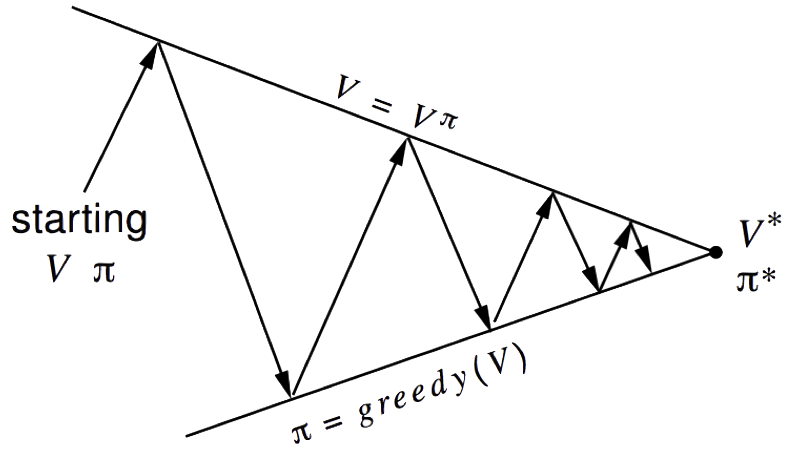
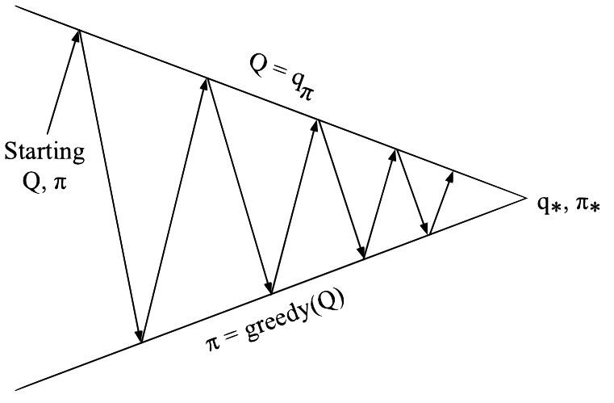
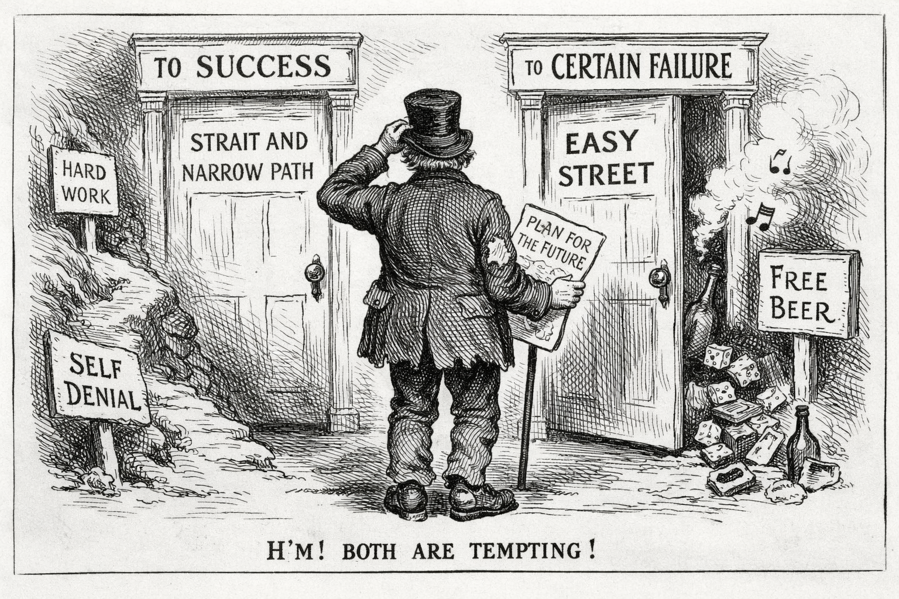
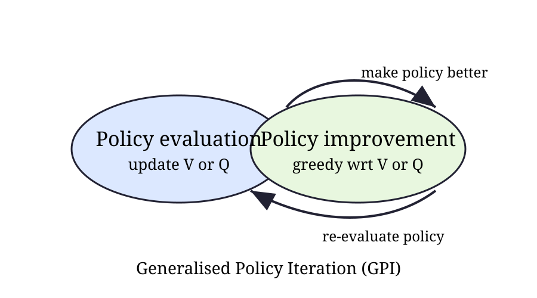
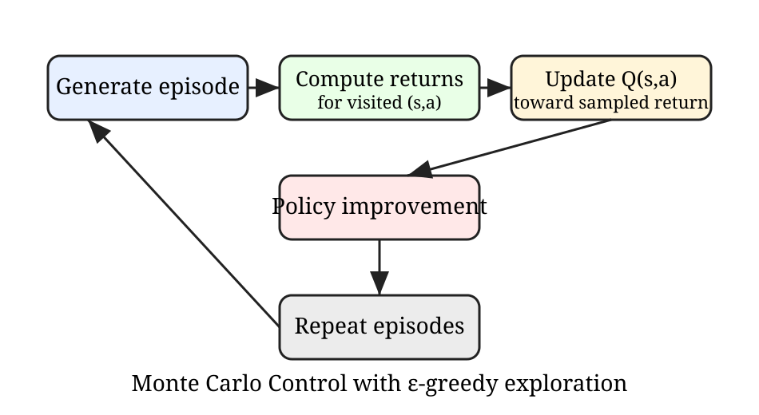
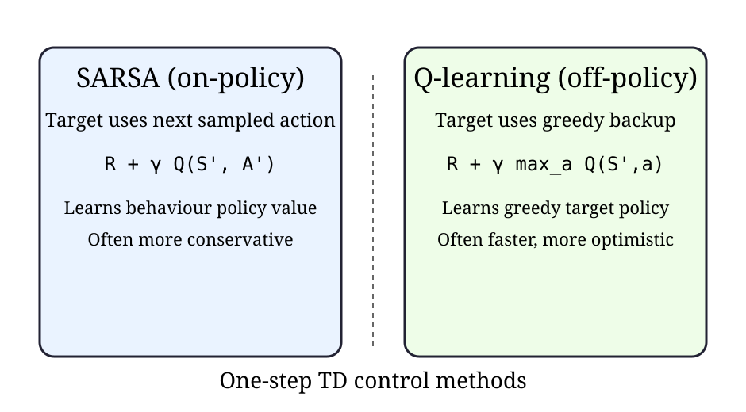

#+Title: Model-Free Control
#+Author: James Brusey
#+Date:
#+Email: james.brusey@coventry.ac.uk
#+Options: toc:nil num:nil timestamp:nil tex:mathjax
#+REVEAL_WIDTH: 1200
#+REVEAL_HEIGHT: 800
#+REVEAL_MARGIN: 0.1
#+REVEAL_MIN_SCALE: 0.1
#+REVEAL_MAX_SCALE: 2.5
#+REVEAL_TRANS: slide
#+REVEAL_SLIDE_NUMBER: t
#+REVEAL_THEME: serif
#+REVEAL_MATHJAX_URL: https://cdn.jsdelivr.net/npm/mathjax@3/es5/tex-chtml-full.js
#+REVEAL_HLEVEL: 1
#+REVEAL_EXTRA_CSS: custom.css

* Overview
** Lecture outline
1. Introduction to model-free control
2. Generalised policy iteration (GPI)
3. Monte Carlo control
4. Temporal-difference control
5. On-policy vs off-policy learning

* Introduction
** Model-Free Reinforcement Learning
- Last lecture:
  - *Model-free prediction*
  - Estimate the value function of an /unknown/ MDP

- This lecture:
  - *Model-free control*
  - Optimise the value function of an /unknown/ MDP

** Uses of Model-Free Control
Some example problems that can be modelled as MDPs:
#+REVEAL_HTML: 

- Elevator
- Parallel Parking
- Ship Steering
- Bioreactor
- Helicopter
- Aeroplane Logistics
#+REVEAL_HTML: 

- Robocup Soccer
- Quake
- Portfolio management
- Protein Folding
- Robot walking
- Game of Go
#+REVEAL_HTML: 

For most of these problems, either:

- The MDP model is unknown, but experience can be sampled
- The MDP model is known, but is too big to use, except by samples

*Model-free control* can solve these problems.
** On and Off-Policy Learning
- *On-policy* learning
  - "learn on the job"
  - learn about policy $\pi$ from experience sampled from $\pi$
- *Off-policy* learning
  - "Look over someone's shoulder"
  - Learn about policy $\pi$ from experience sampled from $\mu$
** Generalised Policy Iteration (Refresher)
#+REVEAL_HTML: 

- Policy evaluation :: Estimate $v_\pi$ e.g., Iterative policy evaluation
- Policy improvement :: Generate $\pi' > \pi$ e.g., Greedy policy improvement
#+REVEAL_HTML: 

file:figures/gpi-loop.png
#+REVEAL_HTML: 

** Generalised Policy Iteration With Monte-Carlo Evaluation
#+attr_html: :height 300px

- Policy evaluation :: Monte-Carlo policy evaluation, $V=v_\pi$?
- Policy improvement :: Greedy policy improvement?

** Model-Free Policy Iteration Using Action-Value Function

Greedy policy improvement over \( V(s) \) requires a model of the MDP:

\[
\pi'(s) = \arg\max_{a \in \mathcal{A}} \left( \mathcal{R}_s^a + \sum_{s'} \mathcal{P}_{ss'}^a V(s') \right)
\]

Greedy policy improvement over \( Q(s,a) \) is model-free:

\[
\pi'(s) = \arg\max_{a \in \mathcal{A}} Q(s,a)
\]
** Generalised Policy Iteration with Action-Value Function
#+attr_html: :height 300px

- Policy evaluation :: Monte-Carlo policy evaluation, \( Q = q_{\pi} \)
- Policy improvement :: Greedy policy improvement?
** Example of Greedy Action Selection
#+REVEAL_HTML: 

#+REVEAL_HTML: 

There are two doors in front of you.

- You open the left door and get reward \(0\)  
  \(V(\text{left}) = 0\)

- You open the right door and get reward \(+1\)  
  \(V(\text{right}) = +1\)

- You open the right door and get reward \(+3\)  
  \(V(\text{right}) = +2\)

- You open the right door and get reward \(+2\)  
  \(V(\text{right}) = +2\)
  $$\vdots$$

- Are you sure you’ve chosen the best door?  

#+REVEAL_HTML: 

** \( \varepsilon \)-Greedy Exploration

- Simplest idea for ensuring continual exploration.

- All \( m \) actions are tried with non-zero probability.

- With probability \( 1 - \varepsilon \), choose the greedy action.  
- With probability \( \varepsilon \), choose an action at random.
    $$
    \pi(a \mid s) = \begin{cases}
    \frac{\varepsilon}{m} + 1 - \varepsilon
    & \text{if } a = \arg\max_{a \in \mathcal{A}} Q(s,a) \\
    \\
    \frac{\varepsilon}{m}
    & \text{otherwise}
    \end{cases}
    $$

** \( \varepsilon \)-Greedy Policy Improvement

#+begin_definition
For any \( \varepsilon \)-greedy policy \( \pi \), the \( \varepsilon \)-greedy policy \( \pi' \) with respect to \( q^{\pi} \) is an improvement:
$$
v^{\pi'}(s) \ge v^{\pi}(s)
$$
#+end_definition

\begin{eqnarray}
q^{\pi}(s, \pi'(s)) &= & \sum_{a \in \mathcal{A}} \pi'(a \mid s)\, q^{\pi}(s,a) \\
& = & \varepsilon / m \sum_{a \in \mathcal{A}} q^{\pi}(s,a) + (1-\varepsilon)\max_{a \in \mathcal{A}} q^{\pi}(s,a) \\
& \ge & \varepsilon / m \sum_{a \in \mathcal{A}} q^{\pi}(s,a) + (1-\varepsilon)\sum_{a \in \mathcal{A}}
\frac{ \pi(a \mid s) - \varepsilon / m}{1 - \varepsilon}  q^{\pi}(s,a) \\
& = &  \sum_{a \in \mathcal{A}} \pi(a \mid s)\, q^{\pi}(s,a) = v^{\pi}(s) 
\end{eqnarray}

Therefore, by the policy improvement theorem, $v^{\pi'}(s) \ge v^{\pi}(s)$.

** Control in reinforcement learning
- *Prediction* estimates the value of a fixed policy.
- *Control* improves behaviour to find an optimal policy.
- In an MDP, the goal is to compute
  $$
  \pi_* = \arg\max_\pi v_\pi(s),\;\forall s\in\mathcal{S}.
  $$
- For action values, we seek
  $$
  q_*(s,a)=\max_\pi q_\pi(s,a).
  $$

** Why model-free control?
- Dynamic programming requires known transition and reward models.
- Many practical RL problems only provide sampled experience.
- Model-free control learns directly from episodes or transitions.
- Typical strategy:
  1. estimate action values,
  2. improve the policy greedily (or nearly greedily),
  3. repeat.

* On-Policy Monte-Carlo Control
** GPI intuition
- GPI alternates between:
  - *policy evaluation* (make values consistent with policy), and
  - *policy improvement* (make policy greedy wrt values).
- These two processes can be partial and interleaved.
- Control algorithms differ mainly in *how* each process is approximated.

** GPI loop diagram
#+attr_html: :height 420px

** Greedy policy improvement
Given action-value estimates $Q(s,a)$, an improved policy is
$$
\pi'(s)=\arg\max_a Q(s,a).
$$
For stochastic exploration, use $\epsilon$-greedy:
$$
\pi(a\mid s)=
\begin{cases}
1-\epsilon+\frac{\epsilon}{|\mathcal{A}(s)|}, & a=\arg\max_b Q(s,b)\\
\frac{\epsilon}{|\mathcal{A}(s)|}, & \text{otherwise.}
\end{cases}
$$

* Monte Carlo Control
** Monte Carlo control setup
- Works with complete episodes.
- Uses returns $G_t$ as unbiased sample targets.
- First-visit MC action-value estimate:
  $$
  Q(s,a) \leftarrow Q(s,a) + \alpha\left(G_t - Q(s,a)\right)
  $$
- Policy is improved between episodes.

** Exploring starts and practical alternatives
- *Exploring starts* guarantees all state-action pairs are visited, but is unrealistic in many tasks.
- In practice, use *soft policies* (e.g., $\epsilon$-greedy) so every action retains non-zero probability.
- This ensures continual exploration during learning.

** Monte Carlo control flow
#+attr_html: :height 430px

** GLIE idea
- GLIE: *Greedy in the Limit with Infinite Exploration*.
- Requirements:
  - every $(s,a)$ visited infinitely often,
  - policy converges to greedy as training proceeds.
- Common schedule: decrease $\epsilon_t \to 0$ slowly over time.

* Temporal-Difference Control
** SARSA (on-policy TD control)
Update using experienced transition $(S_t,A_t,R_{t+1},S_{t+1},A_{t+1})$:
$$
Q(S_t,A_t) \leftarrow Q(S_t,A_t) + \alpha\left[R_{t+1}+\gamma Q(S_{t+1},A_{t+1})-Q(S_t,A_t)\right].
$$
- Learns value of the behaviour policy itself.
- Typically paired with $\epsilon$-greedy exploration.

** Q-learning (off-policy TD control)
Update using greedy bootstrap target:
$$
Q(S_t,A_t) \leftarrow Q(S_t,A_t) + \alpha\left[R_{t+1}+\gamma\max_a Q(S_{t+1},a)-Q(S_t,A_t)\right].
$$
- Behaviour policy can remain exploratory.
- Target policy is greedy wrt current $Q$ estimates.

** SARSA vs Q-learning
#+attr_html: :height 420px

** Expected SARSA
Expected SARSA replaces sampled $Q(S_{t+1},A_{t+1})$ with expectation under policy:
$$
Q(S_t,A_t) \leftarrow Q(S_t,A_t)+\alpha\left[R_{t+1}+\gamma\sum_a\pi(a\mid S_{t+1})Q(S_{t+1},a)-Q(S_t,A_t)\right].
$$
- Lower variance than SARSA.
- Can be more stable with stochastic policies.

* On-Policy and Off-Policy Learning
** Conceptual distinction
- *On-policy*: learn about the policy used to generate data.
  - Example: SARSA.
- *Off-policy*: learn about a target policy different from behaviour policy.
  - Example: Q-learning.
- Off-policy methods are often more data-reuse friendly.

** Behaviour and target policies
- Behaviour policy $b$: generates actions and trajectories.
- Target policy $\pi$: policy we evaluate/improve.
- In value-based control, off-policy methods often keep:
  - exploratory $b$ for coverage,
  - greedy $\pi$ for optimisation.

* Practical Guidance
** Key implementation details
- Initialise $Q(s,a)$ carefully (optimistic initialisation can encourage exploration).
- Tune learning rate $\alpha$ and exploration $\epsilon$ schedules.
- Use episode returns for MC; one-step bootstrapping for TD.
- Track both training reward and policy evaluation performance.

** Summary
- Model-free control solves MDP control from sampled interaction.
- GPI unifies MC and TD control methods.
- MC: episodic, unbiased but higher variance.
- TD: bootstrapped, usually faster and more incremental.
- SARSA is on-policy; Q-learning is off-policy.
