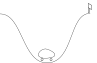

<!-- _class: title -->
<!-- _paginate: false -->

# Function approximation

## Learning values without a table

7043SCN Reinforcement Learning

---

# Today’s question

> How can one update improve predictions for states we have never visited?

By the end, you should be able to:

- explain why large and continuous state spaces need generalisation
- calculate a linear value estimate and weight update
- connect MC, TD and Sarsa to function approximation
- explain how features control what the agent can learn

---

# The table no longer fits

A tabular value function stores one number for every state.

| State description | Approximate number of states |
|---|---:|
| 10 binary variables | $2^{10}=1{,}024$ |
| 30 binary variables | $2^{30}>10^9$ |
| Position and velocity | Continuous |
| Camera image | Vast |

Even a large table cannot predict the value of a state it has never seen.

---

# Generalisation

With a table:

ABCDE

Only $V(C)$ changes.

With shared features:

ABCDE

B, C and D share features, so an update from C changes all three predictions.

---

# Approximate value functions

Replace one parameter per state with a smaller vector of weights:

$$
\hat v(s,\mathbf w)\approx v_\pi(s),
\qquad \mathbf w\in\mathbb R^d
$$

The same weights contribute to many predictions.

Learning now changes both the visited state and other states that share its representation.

---

# Mountain Car

State:

$$
s=(\text{position},\text{velocity})
$$

The agent must build momentum to reach the goal. Position alone does not describe whether the car is moving in a useful direction.

---

<!-- _class: section -->
<!-- _paginate: false -->

# Representation

The features decide which states share what the agent learns

---

# Feature vectors

A feature function converts a state into numbers:

$$
\mathbf x(s)=
\begin{bmatrix}
x_1(s)&x_2(s)&\cdots&x_d(s)
\end{bmatrix}^{\!\top}
$$

For Mountain Car, simple features might be:

$$
\mathbf x(s)=
\begin{bmatrix}
1&\text{scaled position}&\text{scaled velocity}
\end{bmatrix}^{\!\top}
$$

The leading 1 allows the approximator to learn an intercept.

---

# Linear approximation

The prediction is a weighted sum of features:

$$
\hat v(s,\mathbf w)=\mathbf w^\top\mathbf x(s)
$$

For a linear approximator:

$$
\nabla_{\mathbf w}\hat v(s,\mathbf w)=\mathbf x(s)
$$

Linear describes the relationship with the weights. The features themselves may be nonlinear functions of state.

---

# A prediction check

Suppose:

$$
\mathbf x(s)=
\begin{bmatrix}1&0.5&-0.2\end{bmatrix}^{\top},
\qquad
\mathbf w=
\begin{bmatrix}0.4&0.6&-0.5\end{bmatrix}^{\top}
$$

Then:

$$
\hat v(s,\mathbf w)=0.4+(0.6)(0.5)+(-0.5)(-0.2)=\boxed{0.8}
$$

Check the dimensions: two length-3 vectors produce one scalar prediction.

---

# What should be accurate?

The value error depends on how often states matter:

$$
\overline{\mathrm{VE}}(\mathbf w)
=\sum_{s\in\mathcal S}\mu(s)
\left[v_\pi(s)-\hat v(s,\mathbf w)\right]^2
$$

$\mu(s)$ weights the states. It often reflects the fraction of time the policy spends in each state.

An approximator can be accurate on frequently visited states and poor elsewhere.

---

# Stochastic gradient descent

For target $U_t$, the squared error is:

$$
\frac12\left[U_t-\hat v(S_t,\mathbf w_t)\right]^2
$$

The SGD update is:

$$
\mathbf w_{t+1}=\mathbf w_t+
\alpha\left[U_t-\hat v(S_t,\mathbf w_t)\right]
\nabla\hat v(S_t,\mathbf w_t)
$$

The RL method supplies the target. The approximator supplies the gradient.

---

# Linear update

For $\hat v=\mathbf w^\top\mathbf x$, the gradient is simply $\mathbf x$:

$$
\mathbf w_{t+1}=\mathbf w_t+
\alpha\left[U_t-\hat v(S_t,\mathbf w_t)\right]\mathbf x(S_t)
$$

This has three parts:

$$
\text{step size}\times\text{prediction error}\times\text{active features}
$$

Only active features receive an update.

---

# A weight-update check

Continue with $\hat v=0.8$. Let $U=1.0$ and $\alpha=0.1$.

$$
\mathbf w' = \mathbf w+0.1(1.0-0.8)\mathbf x(s)
$$

$$
\Delta\mathbf w
=0.02
\begin{bmatrix}1&0.5&-0.2\end{bmatrix}^{\top}
=
\begin{bmatrix}0.02&0.01&-0.004\end{bmatrix}^{\top}
$$

The target exceeds the prediction, so the prediction for this feature vector should increase.

---

<!-- _class: section -->
<!-- _paginate: false -->

# Prediction with approximation

Keep the familiar MC and TD targets, then update shared weights

---

# Gradient Monte Carlo

Monte Carlo uses the observed return as its target:

$$
U_t=G_t
$$

For a linear approximator:

$$
\mathbf w_{t+1}=\mathbf w_t+
\alpha\left[G_t-\hat v(S_t,\mathbf w_t)\right]\mathbf x(S_t)
$$

The return supplies an unbiased sample of $v_\pi(S_t)$, but we must wait until enough of the episode is known.

---

# Semi-gradient TD(0)

TD uses a bootstrapped target:

$$
U_t=R_{t+1}+\gamma\hat v(S_{t+1},\mathbf w_t)
$$

Define the TD error:

$$
\delta_t=R_{t+1}+\gamma\hat v(S_{t+1},\mathbf w_t)
-\hat v(S_t,\mathbf w_t)
$$

Then:

$$
\mathbf w_{t+1}=\mathbf w_t+\alpha\delta_t\mathbf x(S_t)
$$

---

# Why “semi-gradient”?

The TD target contains $\mathbf w_t$:

$$
R_{t+1}+\gamma\hat v(S_{t+1},\mathbf w_t)
$$

The update treats that target as fixed and differentiates only the current prediction.

$$
\nabla_{\mathbf w}\hat v(S_t,\mathbf w_t)=\mathbf x(S_t)
$$

This is not the full gradient of the squared TD error, hence **semi-gradient** TD.

---

# A TD update check

Suppose $\hat v(S_t)=0.8$, $R_{t+1}=0$, $\hat v(S_{t+1})=1.1$, and $\gamma=0.9$.

$$
\delta_t=0+(0.9)(1.1)-0.8=\boxed{0.19}
$$

With $\alpha=0.1$:

$$
\Delta\mathbf w=0.019\,\mathbf x(S_t)
$$

All active weights move in the direction that increases the current prediction.

---

# Terminal transitions

At termination there is no next-state value:

$$
U_t=R_{t+1}
$$

So:

$$
\delta_t=R_{t+1}-\hat v(S_t,\mathbf w_t)
$$

Setting the terminal bootstrap value to zero is one of the most useful implementation checks.

---

<!-- _class: section -->
<!-- _paginate: false -->

# Control with approximation

Approximate action values and improve the policy as before

---

# Approximate action values

For discrete actions, keep a weight vector for each action:

$$
\hat q(s,a,\mathbf W)=\mathbf w_a^\top\mathbf x(s)
$$

All action values can be computed together:

$$
\hat{\mathbf q}(s)=\mathbf W\mathbf x(s)
$$

An $\varepsilon$-greedy policy can select from these approximate action values exactly as it did from a table.

---

# Semi-gradient Sarsa

Choose $A_{t+1}$ using the current behaviour policy, then form:

$$
\delta_t=R_{t+1}+\gamma\hat q(S_{t+1},A_{t+1},\mathbf W_t)
-\hat q(S_t,A_t,\mathbf W_t)
$$

Update only the weights for the action taken:

$$
\mathbf w_{A_t}\leftarrow
\mathbf w_{A_t}+\alpha\delta_t\mathbf x(S_t)
$$

The target remains on-policy because it uses the next action actually selected by the behaviour policy.

---

# Sarsa implementation order

1. Compute features $\mathbf x(S_t)$
2. Select $A_t$ with $\varepsilon$-greedy action values
3. Take the action and observe $R_{t+1},S_{t+1}$
4. Select $A_{t+1}$ before forming the target
5. Compute $\delta_t$ and update $\mathbf w_{A_t}$
6. Continue from $S_{t+1},A_{t+1}$

At termination, omit both the next action and the bootstrap term.

---

<!-- _class: section -->
<!-- _paginate: false -->

# Choosing features

Representation determines the pattern of generalisation

---

# State aggregation

  

Divide the state space into regions and activate one feature per region.

**Advantage:** simple, fast, and easy to inspect.

**Limitation:** predictions jump at region boundaries. Two nearby states may use different weights.

---

# Polynomial features

For state $s=(p,v)$, features might include:

$$
\mathbf x(s)=
\begin{bmatrix}
1&p&v&p^2&pv&v^2
\end{bmatrix}^{\top}
$$

The prediction remains linear in $\mathbf w$, while the surface can curve with position and velocity.

Higher order terms add flexibility but can amplify scaling problems and behave poorly outside the observed region.

---

# Tile coding

  
<i></i>

  
<i></i>

  
<i></i>

Overlay several offset grids. Each state activates one tile in every tiling.

Nearby states share some active features, so crossing one boundary does not replace the entire representation.

---

# Tile-coded values

If active tile indices are $7, 42, 81,$ and $116$:

$$
\hat v(s)=w_7+w_{42}+w_{81}+w_{116}
$$

Each transition updates those four weights.

With $m$ tilings, a useful starting scale is:

$$
\alpha\approx\frac{\text{desired effective step size}}{m}
$$

Otherwise one sample can create an update roughly $m$ times larger than intended.

---

# Smoothness and discontinuities

Generalisation helps when nearby states have nearby values.

It can hurt near a sharp boundary:

safe<b></b>failure

A small change in state may switch the outcome completely, such as a collision, checkmate, or constraint violation.

Useful representations generalise locally while retaining enough capacity for important boundaries.

---

# Underfitting and overfitting

| Representation | Likely behaviour |
|---|---|
| Too few broad features | Different states receive nearly the same value |
| Useful local features | Experience transfers to relevant neighbours |
| Too many narrow features | Learning approaches a sparse table |
| Highly flexible nonlinear model | Can fit complex structure, but may be unstable |

The best representation supports the distinctions the policy needs to make.

---

<!-- _class: section -->
<!-- _paginate: false -->

# Nonlinear approximation

More capacity brings new optimisation and stability problems

---

# Neural networks

A neural network learns both intermediate features and the final prediction:

$$
s\longmapsto h_1\longmapsto h_2\longmapsto \hat v(s,\mathbf w)
$$

Benefits:

- learns complex nonlinear relationships
- reduces dependence on hand-designed features
- scales to images and other high-dimensional inputs

The update still follows target minus prediction, multiplied by a gradient found through backpropagation.

---

# Correlated experience

Consecutive RL samples are strongly related:

$$
S_t,\ S_{t+1},\ S_{t+2},\ldots
$$

The policy also changes the data distribution while learning.

Experience replay stores transitions and samples shuffled minibatches. This improves data reuse and weakens short-term correlation.

Replay does not guarantee stability, but it is an important part of DQN.

---

# A dangerous combination

Instability becomes more likely when three ingredients appear together:

  function approximation
  bootstrapping
  off-policy learning

This combination is often called the **deadly triad**.

Linear on-policy prediction is comparatively well behaved. Deep off-policy control needs additional stabilisation mechanisms.

---

# Checks worth automating

- **Shapes** — Does $\mathbf W\mathbf x(s)$ produce one value per action?

- **Update direction** — Does a positive error increase the current prediction?

- **Inactive features** — Do their weights remain unchanged?

- **Terminal state** — Does the bootstrap term become zero?

- **Coverage** — Are reported errors based on states the policy actually visits?

- **Scale** — Are features normalised and updates finite?

---

# From tables to features

  tablestate aggregationtile codingneural network

- Approximation replaces stored entries with shared parameters
- Linear methods make the effect of each update easy to inspect
- Features decide where learning generalises
- MC, TD and Sarsa differ mainly in the target they supply

The algorithm and representation must be checked together.

---

# Reading and practical work

Sutton and Barto, *Reinforcement Learning: An Introduction*, 2nd ed.

- Chapter 9: on-policy prediction with approximation
- Chapter 10: on-policy control with approximation
- Chapter 11: off-policy approximation

Practical: compare a Q-table, simple linear features, and tile-coded linear Sarsa on Mountain Car.

